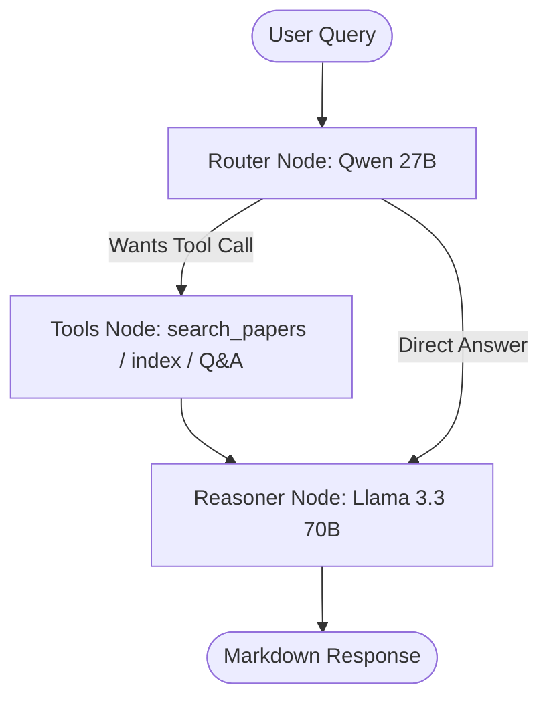
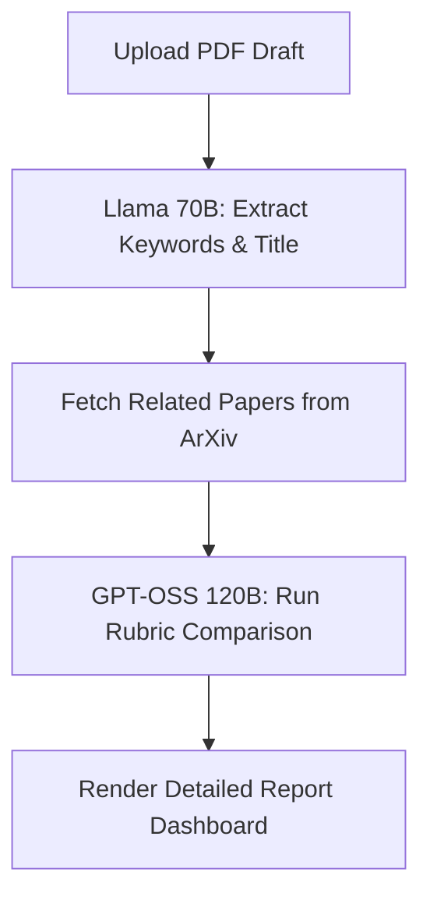

# 🔬 Re-Searcher: ArXiv AI Research Companion

**Re-Searcher** is a powerful AI-driven research assistant designed to query the ArXiv open-source research database, index relevant papers into a vector database, perform context-aware deep retrieval-augmented generation (RAG) Q&A, and provide automated conference-style peer reviews.

Built on a robust multi-model routed agent architecture, Re-Searcher uses dedicated LLMs to route actions and generate professional-grade, cited responses.

---

## 🚀 Key Features

*   **Smart Paper Search**: Query ArXiv with keywords, subject categories, or authors, retrieving up to 10 relevant papers at a time.
*   **Vector Database Indexing**: Download and parse specific ArXiv PDF papers into a local **Qdrant** database with one click.
*   **Deep Contextual Q&A**: Ask detailed questions about any indexed paper's methodology, experiments, or findings, with precise **page number citations**.
*   **Research Paper Quality Reviewer**: Upload your draft paper PDF to automatically extract core terms, retrieve baseline works from ArXiv, and generate a conference-style scorecard and evaluation across four key academic rubric dimensions (Novelty, Rigor, Literature Context, and Writing Quality).
*   **Hybrid Embeddings**: Supports both **Gemini Text Embedding** models (requires Google API Key) and local **HuggingFace Sentence Transformers** for offline vector generation.
*   **Dynamic Settings**: Swap embedding models, reasoning models (such as `llama-3.3-70b-versatile` and `openai/gpt-oss-120b`), and API keys directly from the sidebar.

---

## 🧠 System Architectures

Re-Searcher leverages separate, optimized workflows for both the Conversational Assistant and the Research Draft Reviewer:

### 1. Conversational Chatbot Workflow (LangGraph)
Designed to prevent function-calling failures and optimize generation quality using a **Routed Multi-Model Agent Graph**:



*   **Router Node (`qwen/qwen3.6-27b`)**: Qwen is highly resilient at JSON tool invocation. It receives the conversation history and selects the correct tool without generating malformed token structures.
*   **Tools Execution Node**: Executes Python tools (ArXiv search, PDF parser, and Qdrant database queries).
*   **Reasoner Node (`llama-3.3-70b-versatile`)**: Receives the original user request and the tool outputs to synthesize the final markdown response. Because no tools are bound to Llama 70B, it is immune to function-calling crashes.

### 2. Paper Analyzer Workflow (One-off Pipeline)
Executes a sequential comparative review pipeline when a draft PDF is uploaded:



*   **Extraction Node (`llama-3.3-70b-versatile`)**: Extracts keywords, title, and abstract from the first 5 pages of the draft.
*   **Retrieval Layer**: Performs an ArXiv search using the extracted keywords to establish peer baselines.
*   **Grading Node (`openai/gpt-oss-120b`)**: Compares the draft text against baseline abstracts and generates a structured JSON review detailing rubric scores, strengths/weaknesses, and actionable checklists.

---

## 🛠️ Technology Stack

*   **Frontend**: Streamlit
*   **Orchestration**: LangGraph, LangChain
*   **Models**: Qwen 27B, Llama 70B, GPT-OSS 120B via Groq
*   **Vector Database**: Qdrant
*   **Embeddings**: Gemini API or HuggingFace (`all-MiniLM-L6-v2`)
*   **Environment**: Python 3.12

---

## ⚙️ Installation & Setup

### 1. Prerequisites
Ensure you have Python 3.12 installed on your system.

### 2. Clone and Setup Environment
Clone the repository:
```bash
git clone https://github.com/NatsuEtheral/Re-Searcher.git
cd Re-Searcher
```

Create a virtual environment and install dependencies:
```bash
python -m venv .venv
source .venv/bin/activate  # On Windows: .venv\Scripts\activate
pip install -r requirements.txt
```

### 3. Configure API Keys
Create a `.env` file in the root directory:
```env
GROQ_API_KEY="your-groq-api-key"
GOOGLE_API_KEY="your-google-ai-studio-key"  # Optional: For Gemini Embeddings
```

---

## 🏃 Running the Application

Start the Streamlit application:
```bash
streamlit run app.py
```

Open your browser and navigate to the local URL (usually `http://localhost:8501`).
